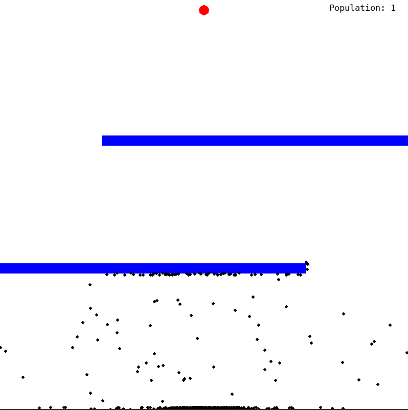

# Smart Dots - A genetic algorithm program

## How it works
The program is a simple visualization of a basic genetic algorithm with some improvements.

It shows a number of dots that are starting on the bottom of a screen and try to find their way to the goal at the top of the screen.

Each dot has a Brain which is a vector of directions (acceleration vectors) initialized at random. 

Every dot dies either because it hit the wall or because of running out of directions in the Brain.

After all dots are died, those who scored the best are chosen most likely as parents and their genome is crossed over to produce a child.

Each child is then slightly mutated and next generation tries it's best at reaching the goal.

Couple of improvements I made:
* Cross over takes 2 parents, and a child gets more genes from a parent who scored better
* A champion of a generation (best dot) survives without mutation to the next generation to ensure that a population won't decrease in performance
* After the dot reaches the goal, it's fitness is calculated based on the amount of steps it took to reach a goal (less steps - better score)
* Obstacles can be placed to the game to make it harder for the dots



## Tech/framework used:
* Python 3.7.3
* Pygame 1.9.6
* Numpy 1.18.5

## Usage
To use the game, simply clone the repository and install needed dependencies
```python
pip install pygame
pip install numpy
```

Then run main.py

```python
python3 main.py
```

To change level (obstacles), size of the population, position of the goal or other parameters - go to main.py and make appropriate changes

```python
dots = Population(400, BRAIN_SIZE)
goal = Goal(int(WIDTH / 2), 20)
obstacles = Obstacle_Generator(level=2)
```

## References
[Tutorial](https://youtu.be/BOZfhUcNiqk) by Code Bullet
